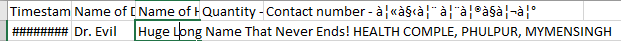

# csv-pretty-view

I hate CSV/Excel sheets. I don't like 'em. Period. I feel a part of me dies every time I have to open one. But life is cruel and sometimes you have to open and go over them. This simple React app tries to mitigate the pains of reading a CSV file. 

## What does this app buy you?

* No more of this: 
 

* Sort the data
* Filter rows based on a value
* Print
* Hide columns

## Technical

* To run: `npm run start`
* To test: `npm run test`
* To build an optimized bundle for production: `npm run build`

